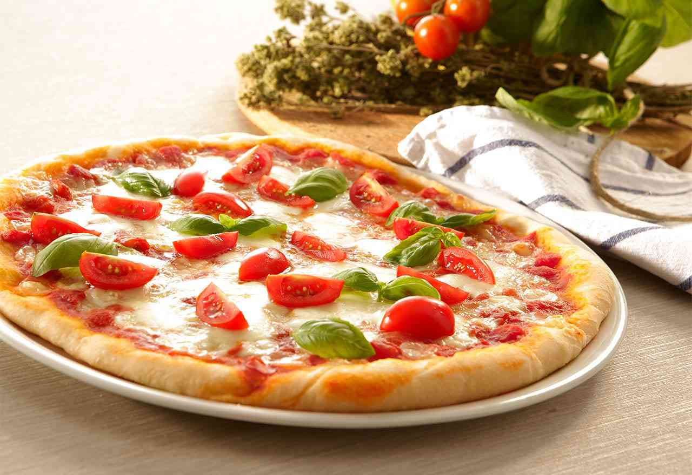
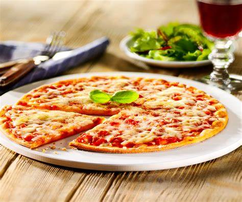

<html>
<head>
  <title>La Florentina</title>
</head>
<body>
<h1>La Florentina</h1>
<h2>Pizzéria</h2>

<table width="100" border="1" >
	<thead>
		<tr>
			<th align="center" >ID</th>
			<th align="center" >Libellé</th>
			<th align="center" >Réference</th>
			<th align="center" >Prix</th>
			<th align="center" >Photo</th>
		</tr>
	</thead>
	<tbody>
		<tr>
			<td align="center" >1</td>
			<td align="center" >Reine</td>
			<td align="center" >PREI</td>
			<td align="center" >9.99$</td>
			<td  align="center" >
				
			</td>
		</tr>
		<tr>
			<td align="center" >2</td>
			<td align="center" >Royale</td>
			<td align="center" >PROY</td>
			<td align="center" >10.99$</td>
			<td  align="center" >
				
			</td>
		</tr>
		<tr>
			<td align="center" >3</td>
			<td align="center" >Napolitaine</td>
			<td align="center" >PNAP</td>
			<td align="center" >11.99$</td>
			<td  align="center" >
				
			</td>
		</tr>
		<tr>
			<td align="center" >4</td>
			<td align="center" >Margharita</td>
			<td align="center" >PMAG</td>
			<td align="center" >8.99$</td>
			<td  align="center" >
				
			</td>
		</tr>
	</tbody>
</table>

</body>
</html>